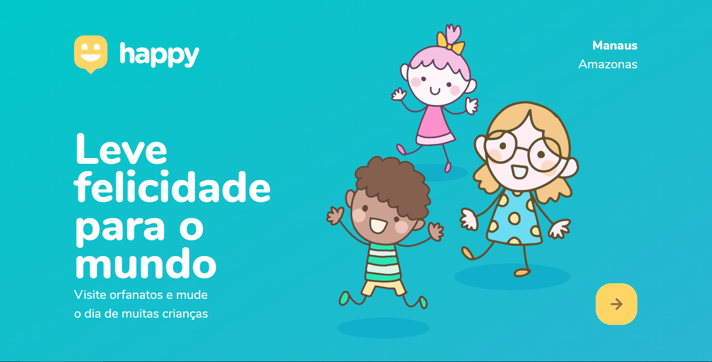

<div align="center">
    
    <hr>
    <div>
        
        
    </div>
</div>

## 🖥 Preview

<strong>Layout Web: </strong> <a target="_blank" href="https://www.figma.com/file/lcsyfHNAcKMfl1rZJbu3rw/Happy-Web?node-id=0%3A1">Figma</a>

<hr>

## 📖 Sobre
<p>
    Este é um projeto desenvolvido durante a <a target="_blank" href="https://nextlevelweek.com/">Next Level Week</a>, realizada pela <a target="_blank" href="https://rocketseat.com.br">@Rocketseat</a> durante os dias 12 a 18 de Outubro de 2020.
</p>

<p>
    Happy é um projeto com o objetivo de trazer maior visibilidade e proporcionar mais visitas a orfanatos.
    <br> 
    Trata-se de uma plataforma web com funcionalidades simples. As entidades (orfanatos) poderão se cadastrar no Happy enviando:    
    <ul>
        <li>até 6 fotos do orfanato</li>
        <li>nome da entidade, número de Whatsapp, horário de atendimento a visitas</li>
        <li>e endereço para que seja exibido no mapa da cidade</li>
    </ul>
</p>

<p>
    Os usuários poderão acessar a plataforma e visualizar:
    <ul>
        <li>todos os orfanatos registrados através do mapa</li>
        <li>informações específicas de um orfanato selecionado</li>
    </ul>
</p>

<hr>

## 🛠 Tecnologias Utilizadas
As seguintes linguagens e ferramentas foram utilizadas neste projeto:
- [HTML]
- [CSS]
- [JavaScript]
- [Node.js](https://nodejs.org)
- [Handlebars](https://handlebarsjs.com)
- [SQLite](https://sqlite.org)

<hr>

## 👨‍💻 Como executar o projeto
```bash
# Clone este repositório
$ git clone https://github.com/rickson-lima/nlw-happy

# Acesse a pasta do projeto
cd nlw-happy

# Instale as dependências
npm i

# Execute o servidor
npm run dev
```

Por fim, abra seu navegador na URL ```http://localhost:5500```
<br>
Você também pode alterar a porta de acesso do localhost em ```src/server.js```
